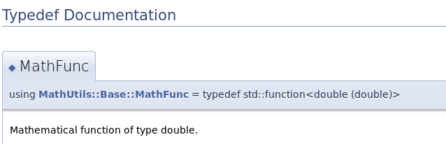
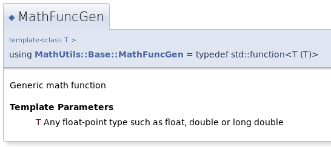
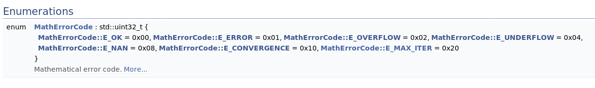
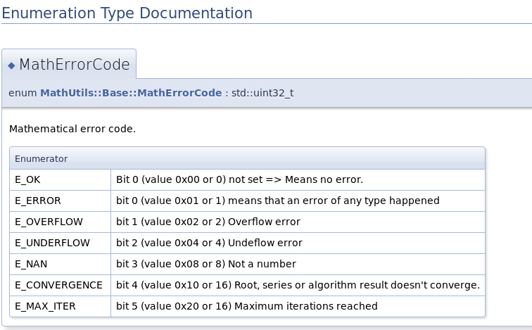
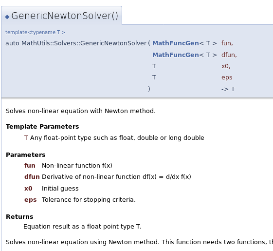
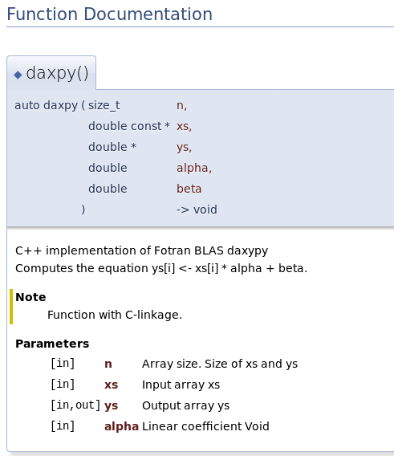
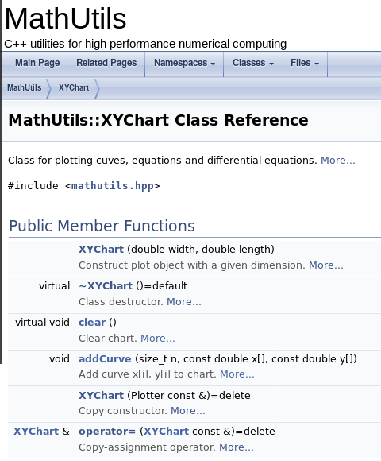
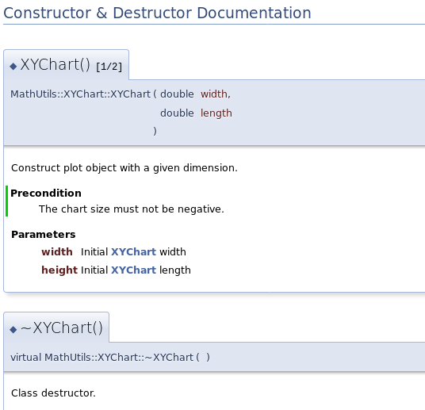
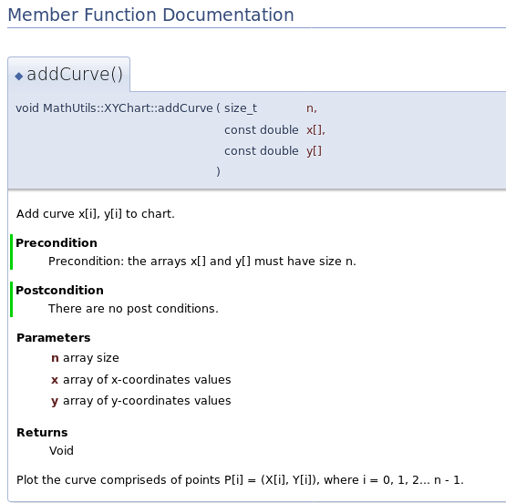

# doxygen
Contains installation, setup and usage guide for doxygen for code documentation


#### Table of Content
1. [Installation](#installation)
	- 1.1. [ROS](#ros)
	- 1.2. [Standard](#standard)
2. [Configuration File](#configuration-file)
3. [Tag Reference](#tag-reference)
4. [Examples](#examples)
	- 4.1. [Type Aliases](#type-aliases)
	- 4.2. [Enumeration](#enumeration)
	- 4.3. [Function](#function)
		- 4.3.1. [C Plus Plus](#c-plus-plus)
		- 4.3.2. [C](#c)
	- 4.4. [Class](#class)
	- 4.5. [Constructor](#constructor)
	- 4.6. [Method](#method)

## Installation

### ROS
[Link to rosdoc_lite](http://wiki.ros.org/rosdoc_lite)

**rosdoc_lite** is a simple program that runs an external documentation tool, like **Doxygen**, **Epydoc**, or **Sphinx**, on a single ROS package.

Install rosdoc_lite:
```
apt-get install ros-$ROS_DISTRO-rosdoc-lite
```

Above command should install **doxygen** from upstream pacakge but if it doesn't you can run following command:
```
sudo apt-get install doxygen
```

Another approach would be to build **doxygen** from source. Refer section **1.2 Standard** in current chapter.

You can use **rosdoc_lite** to generate local copis of documentation. When you run the *rosdoc_lite* command, it will generate documentation into the *doc* folder of the local directory unless output directory is mentioned.
```
Usage: rosdoc_lite [options] [package_path]

Options:
	-h, --help                       Show this help message and exit.
	-q, --quit                       Suppress doxygen errors.
	-o OUTPUT_DIRECTORY              The directory to write documentation to.
	
	-t TAGFILE, --tagfile=TAGFILE    Path to tag configration file for Doxygen.
	                                 Ex: /home/user/tagfiles_list.yaml
	
	-g GENERATE_TAGFILE, --generate_tagfile=GENERATE_TAGFILE
					 This will generate a doxygen tagfile.
					 Ex: /home/user/tags/pacakge.tag

	-p, --generate_qhp               If specified, will generate the Qt Help
                                         Project file index.qhp
```

Generate documentation for a package:
```
rosdoc_lite <path_of_package>
```

### Standard
[Link to official guide](https://doxygen.nl/download.html)

You will require necessary build tools -> g++, python, cmake, flex, bison. For most of them you could go with apt-get install unless you require some specific versions.

Install them with this command:
```
sudo apt-get install g++ python cmake flex bison build-essential
```

Validate installation of each dependency one by one:
```
g++ --version
python --version
cmake --version
flex --version
bison --version
```

Clone official git repo for doxygen:
```
git clone https://github.com/doxygen/doxygen.git
```

Build and make:
```
mkdir build
cd build
cmake -G "Unix Makefiles" ..
make
```

Install build binaries:
```
make install
```

Check installation:
```
doxygen --version
```


## Configuration File

**This section is not required while documentating ROS Nodes as you will be using rosdoc_lite which configures all parameters automatically**.

Each project should have its own configuration file which is used by Doxygen. Inorder to create a template configuration file, use following command:
```
doxygen -g <config-file>
```
Here <config-file> is the name of the configuration file. If the file name is omitted, a file named **Doxyfile** will be created. If "-" (i.e. the minus sign) is used as the file name then doxygen will try to read the configuration file from standard input (stdin), which is useful for scripting. **Keep the default name of configuration file**.

Set the project name:
```
PROJECT_NAME           = "My Project"
```

Set project description:
```
PROJECT_BRIEF          = "Library for loading C++ classes from C or any C-compaible FFI."
```

Set Input directory:
- Directory containing source code to be scanned. In this case, this directory is set to ./src which contains all souerce code src/main.cpp, src/class1.hpp, class1.cpp and so on. The default value of the INPUT is the current directory where is the Doxyfile.
```
# The INPUT tag is used to specify the files and/or directories that contain
# documented source files. You may enter file names like myfile.cpp or
# directories like /user/src/myproject. Separate the files or directores with 
# spaces. See also FILE_PATTERNS and EXTENSION_MAPPING
# Note: IF this tag is empty the current directory is searched.

INPUT                  = ./src
```

Set Output directory:
- Set the directory where html or latext documentation will be generated.
```
# Generates the index.html page at ./docs/html/index.html
OUTPUT_DIRECTORY       = ./docs
```

Force code to be regarded as C++ code:
- Explanation: Header files intended to be used by both C and C++ between the statements _ifdef __cplusplus ... #endif can be understood by Doxygen as C-code, not C++ code. So, any class, struct, namespace of function defined in this namespace will be discarded. The solution to this shortcoming is to notify Doxygen that the macro __cplusplus is defined.
```
# The PREDEFINED tag can be used to specify one or more macro names that are
# defined before the preprocessor is started (similar to the -D option of e.g.
# gcc). The argument of the tag is a list of macros of the form: name or
# name=definition (no spaces). If the definition and the "=" are omitted, "=1"
# is assumed. To prevent a macro definition from being undefined via #undef or
# recursively expanded use the := operator instead of the = operator.
# This tag requires that the tag ENABLE_PREPROCESSING is set to YES.

PREDEFINED             =
```

Disable Latex documentation generation:
- Disabling Latex - makes the generation of documentation faster. Besides that, processing Latex requires a huge number of dependencies.
```
GENERATE_LATEX         = NO
```

Entry: Distribute group doc:
```
# If member grouping is used in the documentation and the DISTRIBUTE_GROUP_DOC
# tag is set to YES then doxygen will reuse the documentation of the first
# member in the group (if any) for the other members of the group. By default
# all members of a group must be documented explicitly.
# The default value is: NO.

DISTRIBUTE_GROUP_DOC   = NO
```

Extract everything from source code
- This option is useful for understanding new code.
```
# If the EXTRACT_ALL tag is set to YES, doxygen will assume all entities in
# documentation are documented, even if no documentation was available. Private
# class members and static file members will be hidden unless the
# EXTRACT_PRIVATE respectively EXTRACT_STATIC tags are set to YES.
# Note: This will also disable the warnings about undocumented members that are
# normally produced when WARNINGS is set to YES.
# The default value is: NO.

EXTRACT_ALL            = NO
```

Source browser
- Useful for navigating and understanding unfamiliar code.
```
# If the SOURCE_BROWSER tag is set to YES then a list of source files will be
# generated. Documented entities will be cross-referenced with these sources.
#
# Note: To get rid of all source code in the generated output, make sure that
# also VERBATIM_HEADERS is set to NO.
# The default value is: NO.

SOURCE_BROWSER         = NO

# Setting the INLINE_SOURCES tag to YES will include the body of functions,
# classes and enums directly into the documentation.
# The default value is: NO.

INLINE_SOURCES         = NO
```

- To omit all *test* directories from a source tree for instance, this can be used:
```
EXCLUDE_PATTERNS= */test/*
```


## Tag Reference 

Following tags should be placed at the top of file.

| Tag                         | Description       |
| --------------------------- | ----------------- |
| ```@file <FILENAME>```      | File Name         |
| ```@author <AUTHOR_NAME>``` | Author Name       |
| ```@brief <BRIEF>```        | Short description |
| ```@date <DATE>```          | Date              |

Example implementation: => FILE: WIDoc.hpp
```
/**
 * @file   WIDoc.hpp
 * @brief  WI Documentation Format
 * @author Somebody from WI
 * @date   2021-05-27
 ***************************************************/
```

Following tags should be used to document Functions, Classes, Methods and so on

| Tag                                  | Description                                                       |
| ------------------------------------ | ----------------------------------------------------------------- |
| **General Description**              |                                                                   |
|                                      |                                                                   |
| ```@brief```                         | Brief description of class or function (fits a single line)       |
| ```@details```                       | Details about class or function                                   |
| ```@author <AUTHOR NAME>```          | Inert author name                                                 |
|                                      |                                                                   |
| **Function Or Method Documentation** |                                                                   |
|                                      |                                                                   |
| ```@param <PARAM> <DESCR>```         | Function or method parameter description                          |
| ```@param[in] <PARAM> <DESCR>```     | Input parameter (C-function)                                      |
| ```@param[out] <PARAM> <DESCR>```    | Output parameter of C-style function that return multiple values  |
| ```@param[in, out] <PARAM> <DESCR``` | Parameter used for both input and output in a C-style function.   |
| ```@tparam <PARAM> <DESCR>```        | Template type parameter                                           |
| ```@trhow <EXCEP-DESCR>```           | Specify exceptions that a function can throw                      |
| ```@pre <DESCR>```                   | Pre conditions                                                    |
| ```@post <DESCR>```                  | Post conditions                                                   |
| ```@return <DESCR>```                | Description of return value or type                               |
|                                      |                                                                   |
| **Code Blocks**                      |                                                                   |
|                                      |                                                                   |
| ```@code ... <C++-Code>.. @encode``` | C++ code example.                                                 |
|                                      |                                                                   |
| **Miscellaneous**                    |                                                                   |
|                                      |                                                                   |
| ```@remark```                        | Additional side-notes                                             |
| ```@note```                          | Insert additional node                                            |
| ```@warning```                       |                                                                   |
| ```@see SomeClass::Method```         | Reference to some class, method, or website                       |
| ```@li```                            | Bullet point                                                      |
| ```@todo <TODO-NOTE>```              | TODO annotation, remainders about what is still needs to be done. | 


## Examples

### Type Aliases

Simple type alias:
```
/// Mathematical function of type double
using MathFunc = std::function<double (double)>;
```



Templated type alias:
```
/// Generic math function
/// @tparam T Any float-point type such as float, double or long double
template<class T>
uaing MathFuncGen = std::function<T (T)>;
```



### Enumeration

Enumeration code
```
/// @brief Mathematical error code
enum class MathErrorCode: std::uint32_t {
	/// Bit 0 (value 0x00 or 0) not set => Means no error
	E_OK          = 0x00,
	/// bit 0 (value 0x01 or 1) means that an error of any type happened
	E_ERROR       = 0x01,
	/// bit 1 (value 0x02 or 2) Overflow error
	E_OVERFLOW    = 0x02,
	/// bit 2 (value 0x04 or 4) Undeflow error
	E_UNDERFLOW   = 0x04,
	/// bit 3 (value 0x08 or 8) Not a number
	E_NAN         = 0x08,
	/// bit 4 (value 0x10 or 16) Root, series or algorithm result doesn't converge.
	E_CONVERGENCE = 0x10,
	/// bit 5 (value 0x20 or 16) Maximum iterations reached
	E_MAX_ITER    = 0x20
};
```

Output:



### Function

#### C Plus Plus
```
/** @brief Contains non-linear equations solvers */
namespace MathUtils::Solvers{
   ... ....    ... ....    ... .... 

   ///  @brief Solves non-linear equation with Newton method.
   ///
   ///  @tparam T   Any float-point type such as float, double or long double
   ///  @param fun  Non-linear function f(x)
   ///  @param dfun Derivative of non-linear function df(x) = d/dx f(x)
   ///  @param x0   Initial guess 
   ///  @param eps  Tolerance for stopping criteria. 
   ///  @return     Equation result as a float point type T.
   ///
   ///  @details
   ///  Solves non-linear equation using Newton method. This function needs two
   ///  functions, the function to be solved @p fun and its derivate @p dfun
   /// 
   ///  @note     The function f(x) must be continues and differentiable.
   ///  @warning  Throws NonCoverge exception when the root is not found.
   /// 
   ///  @see NewtonSolver
   ///  @see https://en.wikipedia.org/wiki/Newton%27s_method    
   ///
   ///  Example: 
   ///  @code 
   ///    // Solve f(x) = x^2 - 25.0 , df(x) = 2x around x0 = 10.0
   ///    auto fun = [](double x){ return x * x -  25.0 };
   ///    auto dfun = [](double x){ return 2 * x; }
   ///     
   ///    double root = GenericNewtonsolver(fun, dfun, 10.0, 0.001);
   ///    std::cout << "Root = " << root << std::endl;
   ///  @endcode
   ///  
  template<typename T>  
  auto GenericNewtonSolver(MathFuncGen<T> fun, MathFuncGen<T> dfun, T x0, T eps) -> T;

} // --- End of Namespace  MathUtils::Solvers ----//
```




#### C
```
/**  @brief C++ implementation of Fotran BLAS daxypy       
     Computes the equation ys[i] <- xs[i] * alpha + beta     

     @note Function with C-linkage. 

     @param[in]      n      Array size. Size of xs and ys
     @param[in]      xs     Input  array xs
     @param[in, out] ys     Output array ys    
     @param[in]      alpha  Linear coefficient 
     @return         Void 
  */
extern "C"
auto daxpy(size_t n, double const* xs, double* ys, double alpha, double beta) -> void;
```


### Class
```
/// @brief Class for plotting cuves, equations and differential equations.
/// @author Ghost Author 
class XYChart{
public:
    /// @brief Construct plot object with a given dimension.
    ///
    /// @pre The chart size must not be negative. 
    ///
    /// @param width  Initial XYChart width
    /// @param height Initial XYChart length
    /// 
    XYChart(double width, double length);

    /// Class destructor 
    virtual ~XYChart() = default;

    /// @brief Clear chart
    /// @details Clear all drawings and plots in the chart area.
    virtual void clear();

    /// @brief Add curve x[i], y[i] to chart
    ///
    /// @pre  Precondition: the arrays x[] and y[] must have size n.
    /// @post There are no post conditions.
    /// 
    /// @param n  array size
    /// @param x  array of x-coordinates values 
    /// @param y  array of y-coordinates values 
    /// @return   Void
    ///
    /// @details
    /// Plot the curve compriseds of points P[i] = (X[i], Y[i]),
    /// where i = 0, 1, 2... n - 1.
    ///
    void addCurve(size_t n, const double x[], const double y[]);

    /// Copy constructor 
    XYChart(Plotter const&) = delete;
    /// Copy-assignment operator 
    XYChart& operator=(XYChart const&) = delete;
private:
};
```


### Constructor
```
/// @brief Construct plot object with a given dimension.
///
/// @pre The chart size must not be negative. 
///
/// @param width  Initial XYChart width
/// @param height Initial XYChart length
/// 
XYChart(double width, double length);
```


### Method
```
/// @brief Add curve x[i], y[i] to chart
///
/// @pre  Precondition: the arrays x[] and y[] must have size n.
/// @post There are no post conditions.
/// 
/// @param n  array size
/// @param x  array of x-coordinates values 
/// @param y  array of y-coordinates values 
/// @return   Void
///
/// @details
/// Plot the curve compriseds of points P[i] = (X[i], Y[i]),
/// where i = 0, 1, 2... n - 1.
///
void addCurve(size_t n, const double x[], const double y[]);
```

